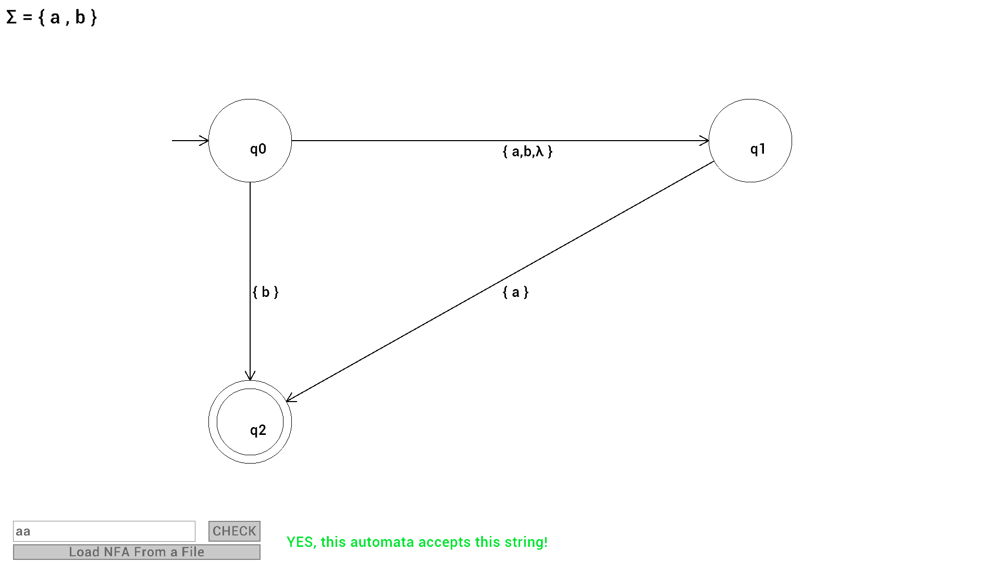

# NFA Visualizer With String Acceptance Check

A graphical automata visualizer written in **C/C++ using Raylib**.  
The project focuses on a complete NFA system with automata initialization and evaluation. also renders visual Model of the automata in real time using raylib. 

---

## Features

- Visual representation of automata states
- Directed transitions between states
- Lightweight and fast rendering using Raylib
- CMake* Cross-platform (Linux, Windows, macOS)
- Reads the whole automata from a text file
- accepts user input and checks if automata accepts that string

---

## Screenshots



a view of the automata renderer

---

- **Language:** C / C++
- **Graphics Library:** [Raylib](https://www.raylib.com/)
- **Build System:** CMake

  ---

  ## Example Configuration (`config.txt`)

```txt
states: q0 q1 q2
alphabet: a b
start: q0
final: q2

# i use 'λ' for epsilon so for assigniing epsilon transitions write something like this "q0 λ q1"
# dont insert blank line between transitions field

transitions:
# 'from' - 'symbol' - 'to'
q0 a q1
q0 b q1 q2
q1 a q2
q0 λ q1
```

---

## Building the Project

i will provide executables for this project after a couple of weeks but you can build it yourself too!

### Dependencies
Make sure Raylib is installed on your system.

#### Arch Linux
```bash
sudo pacman -S raylib
```

### Build Steps

```bash
git clone https://github.com/yourusername/automata-visualizer.git
cd automata-visualizer
mkdir build
cd build
cmake ..
make
```

after compiling just run the program!
